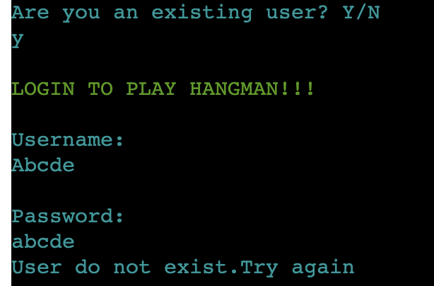
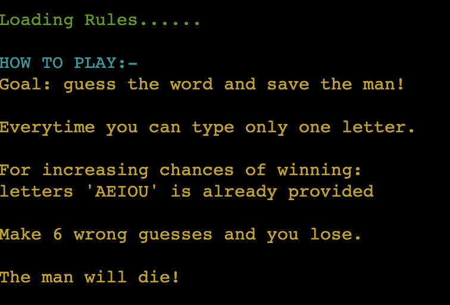
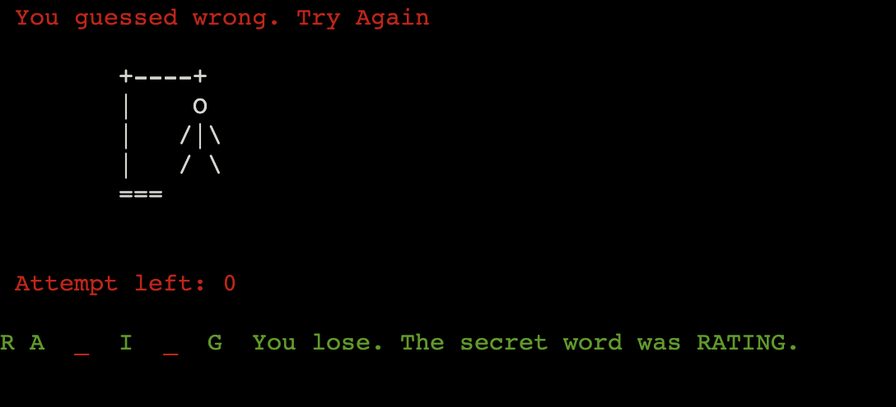
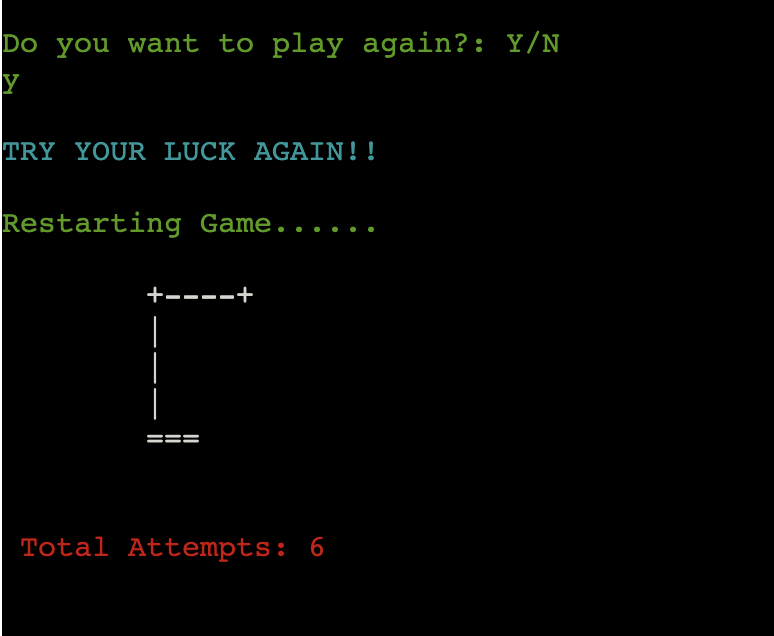

# Hangman 

- Hangman as the name suggest is a game for saving a man from "Hang Till Death" situation.
- Its also a great way to learn new words and game helps to improve vocabulary.
- Game is very simple:-
   - Player get 6 chances to save the man
   - Guess the correct words before chances are over and save the man.

[Link to the website](https://hangman-pp.herokuapp.com/)


## Contents
- [Project Goals](#project-goals)
 - [User Stories](#user-stories)
 - [Site Owner Goals](#site-owner-goals)
- [Features](#features)
  - [Existing Features](#existing-features)
  - [Features to be implemented](#features-to-be-implemented)
- [Technology Used](#technology-used)
 - [Language used](#language-used)
 - [Other websites/tools used](#other-websitestools-used)
 - [3rd Party Python Libraries used](#3rd-party-python-libraries-used)
- [Testing](#testing)
  - [Manual Testing](#manual-testing)
  - [Tested Devices with Browsers](#tested-devices-with-browsers)
  - [Validator Testing](#validator-testing)
  - [Unfixed bugs](#unfixed-bugs)
- [Deployment](#deployment)
  - [Deploying in Heroku](#deploying-the-website-in-heroko)
  - [Cloning of Repo](#cloning-the-repository-in-github)
- [Credits](#credits)
  - [Content](#content)
  - [Code](#code)
- [Thank You](#thank-you)

## Project Goals
### User Stories

- Play Hangman game
- Be able to sign up as new user
- Be able to login as existing user
- Be able to read the rules
- Be able to restart the game
- Be able to use in different media 

### Site Owner Goals

- Create a game which is easy and clear to user
- Ensure that new user is able to signup
- Ensure that existing user can login
- Ensure errors are handled and displayed to user
- Ensure that user is able to understand the game
- Ensure that user can read the rules of the game
- Ensure that user can restart the game


 
## FlowChart

- [Lucidchart](https://www.lucidchart.com) was used to build flowchart


## Features
### Existing Features

#### Home page display

- Once the user run the program this area is displayed
- The area consist of a display showing the heading as provided in image
- It also prompts the users to provide if they are an existing user
    
  

#### User Signup Area

- This area display an instruction for signup for new users
- This area is displayed when player is not an existing user
- Once new username and password is entered, it prompts Signup confirmed..


#### User Login Area

- This area is displayed if user is an existing user
- Users need to login their details to play the game



#### Rules for the Game

- This area shows the rule of the game
- User can decide to see the rules or directly start the game
- After rules is displayed game starts automatically



#### Game display Area

- This area is displayed once the user read the rules or decide to skip the rules
- Initial Display
  - Hangman initial stage
  - Attempts left
  - Six " _ " depicting secret word
- Once player guess a letter, the hint letters are displayed
- This was done to make the game little exicting



#### Restart Game

- Once the play has played the game, they recieve a promt if they want to play again or not
- This is provided for both kind of players: Losers or Winners
- If they decide to play again, the game will restart
- If not the game will end and user will be logged out



### Features to be implemented

- More random words
- Better display
- Different levels as per the size of words
- Multiple logins for multiple player game
- Adding score and logging it

## Technology Used
### Language Used

  - Python

### Other websites/tools used

- [Lucidchart](https://www.lucidchart.com) was used to build flowchart
- [GitHub](https://github.com/) was used for saving and storing files.
- [GitPod](https://www.gitpod.io/) was the IDE used for writing code.
- [Heroku](https://www.heroku.com/) was used as the deploying platform for this site.

### 3rd Party Python Libraries used

- [Google sheets API](https://github.com/burnash/gspread) was used to store and check the user input and authorize the user identity
- [Google OAuth](https://google-auth.readthedocs.io/en/stable/reference/google.oauth2.credentials.html) was used to connect the project with the google account.
- [Colorama](https://pypi.org/project/colorama/) was used for better visual display

## Testing on Browsers
- I tested that this game works in different browsers - Chrome and Safari and was able to deploy successfully

### Manual Testing
#### Updating of Google spreadsheet
- I tested manually by signing up and checking whether worsheet id being updated.
- It was getting updated everytime signed up succesfully


#### User Exist 
- Once the users load the game, they are promt to confirm if they are new user or existing user.
- If the input provided is not "Y" or "N", it throws error.
- If the input is "Y", the login area opens
- If the input is "N", the sign up area opens
- I tried it personally and the error for invalid input was thrown.
- No errors found


#### Sign Up

- I signed up personally and asked my husband to do also
- When the username and password were less than 4 characters it was throwing error
- If username existed before it was throwing error
- Once sign up was confirmed the worsheet was updating
- No error found


#### Login

- After signing up I and my husband logged in again
- Once the username and password entered was correct, login was successful
- If it was wrong, an error was thrown and asked to login again
- It was able to extract data from worksheet to validate username and password
- No errors found


#### Rules Area

- Once login was successful, game started prompting user to see rules or not
- If user enter invalid input, an error was thrown and question was prompted again
- If user decides to see rules, rules were displayed and game starts automatically.
- If user do not want to see rules, game starts automatically
- No errors found


#### Restart Game

- Once user is done with playing, they are prompted if they want to restart or not.
- If user enters invalid input, error is thrown and question is ask again
- If user wants to continue, the game will restart
- If not game will end and user will be logged out
- No errors found


### Tested Devices with Browsers
- iPhone 12
    - Safari
- Samsung S22 Ultra
    - Chrome
- Macbook Pro 2019 16-inch
    - Chrome
    - Safari

### Validator Testing
#### PEP8 Python Validator
- [PEP8 Python Validator](https://pep8ci.herokuapp.com/) was used to validate the code
- No errors were found

- Result: gsheet.py


- Result: run.py


### Unfixed Bugs
- No unfixed bugs.

## Deployment

### Deploying the website in Heroko:
- The website was deployed to Heroko using following steps:
#### Login or create an account at Heroku
- Make an account in Heroko and login


#### Creating an app
  - Create new app in the top right of the screen and add an app name.
  - Select region
  - Then click "create app".


#### Open settings Tab
  ##### Click on config var
  - Store CREDS file from gitpod in key and add the values
  - Store PORT in key and value


  ##### Add Buildpacks
  - Add python buildpack first
  - Add Nodejs buildpack after that


 #### Open Deploy Tab
   ##### Choose deployment method
  - Connect GITHUB
  - Login if prompted


   ##### Connect to Github
  - Choose repositories you want to connect
  - Click "Connect"


  ##### Automatic and Manual deploy
  - Choose a method to deploy
  - After Deploy is clicked it will install various file


  ##### Final Deployment
  - A view button will display
  - Once clicked the website will open


### Cloning the repository in GitHub
1. Visit the GitHub page of the website’s repository
2. Click the “Clone” button on top of the page
3. Click on “HTTPS”
4. Click on the copy button next to the link to copy it
5. Open your IDE
6. Type ```git clone <copied URL>``` into the terminal

## Credits

### Content
- The text content was provided by the site owner.
- Idea of Hangman game has been taken from hangman game played around the world

### Code
#### The following ideas were borrowed from [Love Sandwiches](https://github.com/Sinha5714/Love_Sandwiches)

-  validate_user_details function
-  How to import gspread
-  How to import Credentials from google.oauth

#### The following code idea was taken from google search and various youtube videos

- play_hangman function; (https://www.youtube.com/shorts/GYCCN0IP8u0)
- How to clear terminal from google


### Thank You
- to my mentor Mo Shami for supporting me with his feedback through the entire project
- special thanks to my husband Remo Liebetrau to help me finding out the issues in the game
- to Code Institute and Slack community for helping me when I was getting stuck with some challenges.